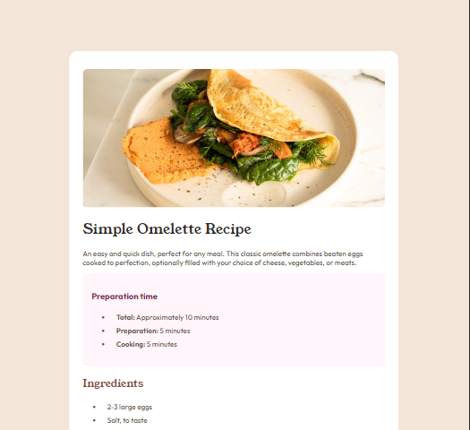
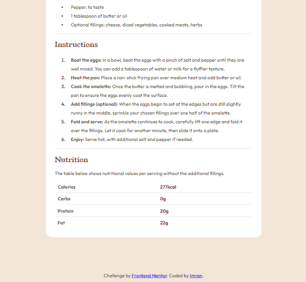

# Frontend Mentor - Recipe page solution

This is a solution to the [Recipe page challenge on Frontend Mentor](https://www.frontendmentor.io/challenges/recipe-page-KiTsR8QQKm). Frontend Mentor challenges help you improve your coding skills by building realistic projects.

## Table of contents

- [Overview](#overview)
  - [Screenshot](#screenshot)
  - [Links](#links)
  - [Built with](#built-with)
  - [What I learned](#what-i-learned)
- [Author](#author)

## Overview

### Screenshot

### Links

- Solution URL: [Add solution URL here](https://github.com/m-im-ha/recipe-page/tree/main/recipe-page-main)
- Live Site URL: [Add live site URL here](https://recipe-page-clmrtyqv9-imrans-projects-6d71f834.vercel.app/)

### Built with

- Semantic HTML5 markup
- CSS custom properties
- Flexbox

### What I learned

By this challege, I've leanred about semantic HTML5 markup, CSS custom properties.

## Author
- Frontend Mentor - [@m-im-ha](https://www.frontendmentor.io/profile/m-im-ha)

